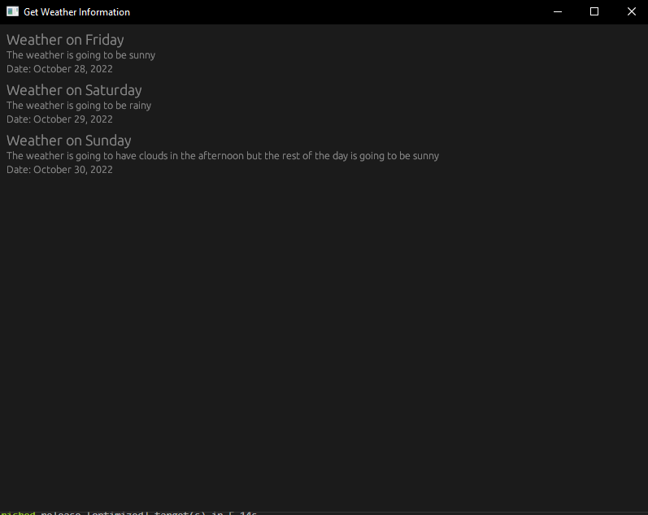

# GWIP Get Weather Information App
This is just a fun project to try the egui crate. I didn't really focus on how it looks

## What it looks like

## The weather api
I just build a simple rest api for this so I could try to fetch data from somewhere. If I want to make more with this I will try to use a real one and make a new api call with each refresh to see if there are new posts
